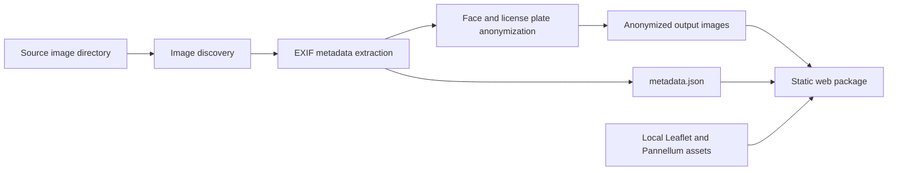

# Street Viewer 360 - Project Development Plan

## 1. Project Overview

Street Viewer 360 is a local command-line tool that processes 360-degree panorama images, anonymizes privacy-sensitive content, extracts geospatial metadata, and generates a static web package for browsing the images on an interactive map.

The first version is intentionally scoped as a local static generator. It should run on macOS and Linux, read images from a local source directory, and produce a self-contained output directory that can be opened in a browser or served as static files.

## 2. MVP Scope

The MVP should support one local image collection at a time.

### In Scope

- A Python-based CLI for macOS and Linux.
- Reading panorama images from a local source directory.
- Extracting EXIF metadata, including GPS latitude, GPS longitude, heading when available, and timestamp when available.
- Automatic best-effort anonymization of faces and license plates.
- CPU execution by default, with optional CUDA acceleration when available.
- Generation of a static web package containing:
  - `index.html`
  - anonymized panorama images
  - `metadata.json`
  - local JavaScript and CSS assets
- Leaflet-based map view with image markers.
- Pannellum-based 360 panorama viewer.
- Configuration through `config.yaml`, with CLI arguments overriding config values.
- Offline-ready frontend assets, meaning no runtime CDN dependencies.

### Out of Scope for MVP

- Multi-user web application.
- Server-side project management.
- Authentication or user management.
- Cloud storage or cloud processing.
- Manual anonymization review UI.
- Strict audit trail for anonymization decisions.
- Editing panorama metadata from the frontend.

## 3. Key Requirements

### Functional Requirements

- The CLI must accept an input directory and output directory.
- The pipeline must skip unsupported files and report them clearly.
- The pipeline must preserve a traceable relationship between source images and generated images.
- Images without usable GPS coordinates must be reported and excluded from the map by default.
- The frontend must show each geotagged panorama as a marker on the map.
- Clicking a marker must open the corresponding panorama in the viewer.
- The generated package must be usable without a build step after generation.

### Non-Functional Requirements

- The MVP should favor predictable local execution over architectural complexity.
- The generated frontend should not depend on external runtime services, except optional configured map tile URLs.
- The CLI should provide readable progress and error messages.
- The anonymization process should avoid modifying source images.
- The metadata format should be stable enough for future migration into a richer project format.

## 4. Proposed Architecture



The system should be organized as a small Python package with a thin CLI layer and separate modules for discovery, metadata extraction, anonymization, output generation, and frontend templates.

## 5. Suggested Repository Structure

```text
street-viewer-360/
  PROJECT_DEVELOPMENT_PLAN.md
  README.md
  pyproject.toml
  config.example.yaml
  src/
    street_viewer_360/
      __init__.py
      cli.py
      config.py
      discovery.py
      metadata.py
      anonymization.py
      generator.py
      templates/
        index.html.j2
        app.js.j2
        styles.css
      assets/
        leaflet/
        pannellum/
  tests/
    test_config.py
    test_metadata.py
    test_generator.py
  examples/
    config.yaml
```

This structure keeps the CLI and processing pipeline testable while allowing the generated web package to remain simple static output.

## 6. CLI Proposal

The main command can be named `street-viewer-360`.

```bash
street-viewer-360 generate \
  --input ./source-images \
  --output ./dist \
  --config ./config.yaml
```

Recommended options:

```text
generate
  --input PATH              Source directory containing panorama images.
  --output PATH             Output directory for the generated static package.
  --config PATH             Optional YAML configuration file.
  --recursive / --no-recursive
  --overwrite               Allow replacing an existing output directory.
  --device auto|cpu|cuda|mps
  --blur-sigma NUMBER
  --default-zoom NUMBER
  --include-without-gps     Include non-geotagged images in metadata but not map markers.
  --dry-run                 Inspect inputs and metadata without writing output.
```

The default behavior should be conservative:

- Do not overwrite an existing output directory unless `--overwrite` is provided.
- Do not modify source files.
- Exclude images without GPS coordinates from map markers.
- Use `device: auto` unless explicitly configured.

## 7. Configuration Proposal

`config.yaml` should provide defaults that can be overridden by CLI arguments.

```yaml
default_zoom: 13
output_dir: "./dist"
recursive: true
overwrite: false
device: "auto"

anonymization:
  enabled: true
  blur_sigma: 15
  detector: "yolov8"
  confidence_threshold: 0.35

metadata:
  include_without_gps: false
  timezone: "local"

map_layers:
  - name: "OpenStreetMap"
    url: "https://{s}.tile.openstreetmap.org/{z}/{x}/{y}.png"
    attribution: "(c) OpenStreetMap contributors"
    default: true
  - name: "Satellite"
    url: "https://server.arcgisonline.com/ArcGIS/rest/services/World_Imagery/MapServer/tile/{z}/{y}/{x}"
    attribution: "Tiles (c) Esri"
    default: false
```

Runtime frontend dependencies should be copied into the generated package from local project assets instead of loaded from CDNs.

## 8. Processing Pipeline

### 8.1 Image Discovery

- Find supported image files from the input directory.
- Supported extensions for MVP: `.jpg`, `.jpeg`, `.png`.
- Keep deterministic ordering for stable output.
- Record skipped files and unsupported extensions in the generation summary.

### 8.2 Metadata Extraction

- Extract GPS latitude and longitude.
- Extract heading when available from EXIF or camera-specific tags.
- Extract capture timestamp when available.
- Normalize coordinates into decimal degrees.
- Store source filename and generated output path.

Potential libraries:

- `Pillow` for image handling and basic EXIF access.
- `ExifRead` for broader EXIF tag coverage if Pillow is insufficient.

### 8.3 Anonymization

- Detect privacy-sensitive regions, initially faces and license plates.
- Apply Gaussian blur or equivalent OpenCV blur to detected regions.
- Save anonymized images into the output image directory.
- Keep source images unchanged.

Potential libraries:

- YOLOv8 or a compatible object detection model for detection.
- OpenCV for blur operations.
- PyTorch device detection for `cuda`, `mps`, or `cpu`.

For MVP, anonymization is automatic best-effort. The generated documentation and CLI output should clearly state that users are responsible for reviewing output before publication.

### 8.4 Static Package Generation

The output directory should be structured like this:

```text
dist/
  index.html
  metadata.json
  images/
    pano_000001.jpg
    pano_000002.jpg
  assets/
    leaflet/
    pannellum/
    app.js
    styles.css
  generation_report.json
```

`generation_report.json` should summarize processing results, warnings, skipped files, images without GPS, and anonymization counts when available.

## 9. Metadata Schema Proposal

`metadata.json` should be a stable frontend-facing file.

```json
{
  "version": 1,
  "generated_at": "2026-05-12T10:00:00Z",
  "default_zoom": 13,
  "map_layers": [
    {
      "name": "OpenStreetMap",
      "url": "https://{s}.tile.openstreetmap.org/{z}/{x}/{y}.png",
      "attribution": "(c) OpenStreetMap contributors",
      "default": true
    }
  ],
  "panoramas": [
    {
      "id": "pano_000001",
      "source_filename": "IMG_0001.jpg",
      "image_path": "images/pano_000001.jpg",
      "lat": 60.1699,
      "lon": 24.9384,
      "heading": 90.0,
      "captured_at": "2026-05-12T09:30:00Z",
      "anonymization": {
        "status": "processed",
        "detections": {
          "faces": 2,
          "license_plates": 1
        }
      }
    }
  ]
}
```

The frontend should treat optional fields such as `heading`, `captured_at`, and detection counts defensively.

## 10. Frontend Behavior

The generated `index.html` should load local assets and `metadata.json`.

Expected MVP behavior:

- Initialize a Leaflet map.
- Load configured map layers.
- Add markers for panoramas with valid coordinates.
- Fit the map bounds to available markers.
- Open the selected panorama in a Pannellum viewer when a marker is clicked.
- Show basic image details such as filename and timestamp when available.
- Display a clear message if no geotagged panoramas are available.

The frontend should be generated as static files and should not require a framework for the MVP.

## 11. Error Handling and Reporting

The CLI should distinguish between fatal errors and warnings.

Fatal errors:

- Input directory does not exist.
- Output directory exists without `--overwrite`.
- Configuration file cannot be parsed.
- No supported images are found.

Warnings:

- Image has no GPS coordinates.
- Image metadata is partially missing.
- Anonymization detector is unavailable and anonymization is disabled only if explicitly allowed.
- Individual image fails processing while others can continue.

The generation report should make it easy to review what happened after a run.

## 12. Testing Strategy

Recommended tests for MVP:

- Config loading and CLI override behavior.
- Image discovery with supported and unsupported files.
- EXIF GPS parsing using fixture images.
- Metadata JSON generation.
- Output directory generation.
- Handling of missing GPS coordinates.
- Frontend template rendering with representative metadata.

Anonymization tests should start with unit-level validation of blur application on known regions. Model accuracy testing can be added later with curated fixtures.

## 13. Implementation Milestones

### Milestone 1: Project Skeleton

- Add Python packaging with `pyproject.toml`.
- Add CLI entry point.
- Add configuration loading.
- Add basic tests and linting setup.

### Milestone 2: Metadata Pipeline

- Implement image discovery.
- Extract EXIF metadata.
- Generate `metadata.json`.
- Generate a basic processing report.

### Milestone 3: Static Frontend Generator

- Add Jinja2 templates for `index.html`, `app.js`, and `styles.css`.
- Copy local Leaflet and Pannellum assets.
- Render markers and panorama viewer from metadata.

### Milestone 4: Anonymization

- Add detector integration.
- Add blur processing.
- Add device selection for `auto`, `cpu`, `cuda`, and `mps`.
- Add detection counts to `metadata.json` and `generation_report.json`.

### Milestone 5: Validation and Polish

- Improve error messages.
- Add sample configuration.
- Add README usage instructions.
- Test the generated package locally with representative sample images.

## 14. Risks and Open Decisions

- EXIF heading tags may vary between camera vendors and may require camera-specific handling.
- License plate detection quality depends heavily on the selected model and training data.
- macOS MPS support may not work consistently for all detection models.
- Offline-ready JavaScript assets must be vendored or copied during setup in a controlled way.
- Map tile URLs may still require network access unless a local tile source is configured.
- Large panorama images may require memory-conscious processing.

## 15. Future TODOs

- Add a manual anonymization review workflow where users can inspect, approve, and correct blur regions before final package generation.
- Add a stricter audit trail for anonymization decisions, including detected regions, confidence scores, model version, and processing timestamps.
- Add support for non-GPS panoramas through manual placement or imported coordinate files.
- Add support for GPX track matching when image GPS metadata is missing.
- Add project manifests for regenerating or updating an existing package.
- Add optional local tile packages for fully offline map usage.
- Add Docker-based processing for reproducible Linux GPU execution.
- Add end-to-end browser tests for generated web packages.

## 16. Initial Development Recommendation

Start with metadata extraction and static package generation before integrating anonymization. This creates a visible end-to-end workflow early and makes later anonymization work easier to validate against real generated output.

The first useful development target should be:

```bash
street-viewer-360 generate --input ./examples/images --output ./dist --config ./examples/config.yaml
```

After this command works with fixture images and produces a browsable static package, anonymization can be integrated into the same pipeline.
