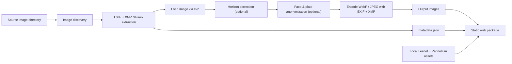

# Street Viewer 360 - Architecture & Design

This document describes the current architecture of street-viewer-360. For
open tasks and future work see [TODO.md](TODO.md).

## 1. Overview

Street Viewer 360 is a local command-line tool that turns a folder of
360-degree panorama photos into a static, browsable web package: a Leaflet
map with markers and a Pannellum panorama viewer, optionally with faces and
license plates blurred. The generator runs on macOS and Linux, reads images
from a local directory, and writes a self-contained output directory that
can be opened in a browser or served as static files.

The tool is intentionally scoped as a local static generator. It does not
provide a multi-user web app, server-side project management, authentication,
cloud storage, manual anonymization review UI, or frontend-side metadata
editing.

## 2. Capabilities

- Reads `.jpg`, `.jpeg`, `.png`, and `.36P` (GoPro MAX 2 panorama) files.
- Extracts EXIF metadata: GPS lat/lon, heading, timestamp, camera info.
- Extracts XMP GPano metadata: projection type and pose angles.
- Auto-levels equirectangular panoramas when the camera was tilted at
  capture time (XMP `GPano:Pose{Heading,Pitch,Roll}Degrees`).
- Best-effort face and license-plate detection via YOLOv8 with Gaussian
  blur over each detection box.
- Tiled inference for high-resolution panoramas to improve recall on small
  objects.
- CPU, CUDA, or MPS device selection.
- Output as WebP (default) or JPEG, preserving EXIF and XMP.
- Generates `index.html`, `metadata.json`, `generation_report.json`, an
  `images/` directory, and local Leaflet + Pannellum assets.
- Frontend opens panoramas via marker clicks, supports keyboard navigation,
  shareable URL bookmarks, and a map+viewer split view.

## 3. Architecture



The pipeline decodes each source image once and threads a single in-memory
numpy array through the optional horizon correction and anonymization
stages before encoding it in the chosen output format. EXIF and XMP from
the source are embedded in the output, with the GPano pose angles reset to
zero whenever horizon correction was applied so downstream 360 viewers do
not re-rotate.

## 4. Repository Structure

```text
street-viewer-360/
  PROJECT_DEVELOPMENT_PLAN.md   # this document
  TODO.md
  README.md
  pyproject.toml
  Justfile
  config.example.yaml
  src/
    street_viewer_360/
      __init__.py
      cli.py              # typer entry point
      config.py           # pydantic AppConfig + YAML loader
      discovery.py
      device.py           # auto / cpu / cuda / mps resolution
      metadata.py         # EXIF + XMP GPano extraction
      horizon.py          # equirectangular ERP rotation
      image_io.py         # unified load + save (jpeg, webp, metadata)
      anonymization.py    # YOLOv8 detectors + blur
      generator.py        # pipeline orchestration
      frontend.py         # Jinja2 rendering + asset copy
      models.py           # optional .pt download helper
      templates/
        index.html.j2
        app.js.j2
        styles.css
      assets/
        leaflet/
        pannellum/
  tests/
```

## 5. CLI

The main command is `street-viewer-360` with three subcommands:

- `generate` - run the full pipeline.
- `refresh-frontend` - re-render frontend assets without re-processing images.
- `download-models` - fetch default YOLOv8 face and plate weights.

CLI flags override config-file values, which override built-in defaults.
The full flag list lives in [README.md](README.md); the most consequential
flags are `--input`, `--output`, `--config`, `--overwrite`,
`--no-anonymization`, `--horizon`, `--output-format`, and `--webp-method`.

Default behavior is conservative:

- Do not overwrite an existing output directory without `--overwrite`.
- Do not modify source files.
- Exclude images without GPS from map markers.
- Auto-detect device (`device: auto`).
- Auto-correct horizon when GPano pose angles exceed 0.2 degrees.

## 6. Configuration

`config.example.yaml` documents every option. The top-level shape is:

```yaml
default_zoom: 13
output_dir: ./dist
recursive: true
overwrite: false
device: auto

anonymization: { ... }   # enable, model paths, thresholds, tiling
horizon: { ... }         # mode, threshold, offsets
output: { ... }          # format, quality, webp_method
metadata: { ... }        # include_without_gps, timezone
path: { ... }            # max gaps that break the map polyline
viewer: { ... }          # min/max field of view
map_layers: [ ... ]
```

CLI arguments override config values, which override defaults.

## 7. Pipeline Stages

### 7.1 Image discovery

Finds supported image files in deterministic order (`sorted`). Records
skipped and unsupported files in the generation summary.

### 7.2 Metadata extraction

- EXIF via `exifread`: GPS lat/lon (normalized to decimal degrees), GPS
  heading, capture timestamp, image dimensions, camera make and model.
- XMP via Pillow's `Image.getxmp()` (defusedxml-backed): projection type
  and GPano pose angles (heading, pitch, roll in degrees).
- Defensive against missing or malformed tags; missing values become None
  rather than raising.

### 7.3 Horizon correction

Equirectangular-only. Decides per-image whether to rotate based on
`config.horizon.mode`:

- `auto` (default) - rotate when `max(|pitch|, |roll|, |heading|)` exceeds
  `min_angle_degrees` (default 0.2).
- `always` - rotate whenever pose data or manual offsets are present.
- `never` - skip entirely.

Manual offsets in degrees can be added (or override XMP entirely via
`override_metadata: true`). Rotation uses `cv2.remap` with bilinear
interpolation by default; nearest and bicubic are also available. The frame
convention is x=forward, y=left, z=up, with GPano sign conventions
(positive pitch = nose up, positive roll = right wing down, positive
heading = clockwise from above).

After rotation the GPano pose angles in the embedded XMP are reset to 0.0
so other 360 viewers do not re-apply the correction.

### 7.4 Anonymization

Best-effort face and license-plate detection with YOLOv8 (ultralytics).
Each detection is dilated by `expand_box_ratio` and Gaussian-blurred in
place. For high-resolution panoramas the image is tiled with overlap to
preserve recall on small objects; tile detections are merged and pruned
with non-maximum suppression. Per-detector confidence thresholds let face
and plate models be tuned independently.

Anonymization is opt-in via model paths. Without model files the stage is
skipped with a warning and the image is passed through untouched (status
`no_models` in `generation_report.json`).

### 7.5 Encoding

A single `image_io.save` writes the in-memory array in WebP or JPEG using
Pillow. EXIF and XMP segments are extracted from the source (also via
Pillow's `info` dict) and embedded in the output. WebP method (encoder
effort, 0..6) is configurable; default is 4. JPEG quality and WebP quality
share the same `output.quality` knob (1..100, default 90).

When neither horizon correction nor anonymization runs, the source is
re-encoded in the chosen format via `image_io.copy_with_format` rather
than copied verbatim, so users still get a consistent output format.

### 7.6 Static package generation

```text
dist/
  index.html
  metadata.json
  generation_report.json
  images/
    pano_000001.webp
    pano_000002.webp
    ...
  assets/
    leaflet/
    pannellum/
    app.js
    styles.css
```

`generation_report.json` summarizes inputs, outputs, anonymization counts,
horizon-correction counts, and per-image failures.

## 8. Metadata Schema

`metadata.json` is the frontend-facing contract. Version 1:

```json
{
  "version": 1,
  "generated_at": "2026-05-19T08:00:00Z",
  "default_zoom": 13,
  "map_layers": [ ... ],
  "path": { "max_gap_meters": 50.0, "max_gap_seconds": 10.0 },
  "viewer": { "min_hfov": 30.0, "max_hfov": 120.0 },
  "panoramas": [
    {
      "id": "pano_000001",
      "source_filename": "GSAA0060.36P",
      "image_path": "images/pano_000001.webp",
      "lat": 60.1902,
      "lon": 24.9610,
      "heading": 90.0,
      "captured_at": "2026-05-12T08:27:04",
      "camera": { "make": "GoPro", "model": "MAX2" },
      "dimensions": { "width": 7680, "height": 3840 },
      "anonymization": {
        "status": "processed",
        "detections": { "faces": 2, "license_plates": 1 }
      },
      "horizon_correction": {
        "applied": true,
        "pitch": -13.4,
        "roll": 0.0,
        "heading": 0.0,
        "reason": "mode=auto"
      }
    }
  ]
}
```

Optional fields (`heading`, `captured_at`, `camera`, `dimensions`,
detection counts) are treated defensively by the frontend.

## 9. Error Handling

Fatal errors (CLI exits with non-zero status):

- Input directory missing.
- Output directory exists without `--overwrite`.
- Config file cannot be parsed or fails pydantic validation.
- No supported images found.

Warnings (per-image, processing continues):

- Image lacks GPS coordinates.
- Anonymization detectors unavailable.
- Individual image fails to decode or process.

`generation_report.json` makes it easy to review what happened after a run.

## 10. Testing

`pytest` covers:

- Config loading and CLI-override behavior (`test_config.py`).
- Image discovery with supported and unsupported files (`test_discovery.py`).
- EXIF GPS parsing on synthetic fixtures (`test_metadata.py`).
- Anonymizer blur logic and NMS (`test_anonymization.py`).
- Generator end-to-end including format selection (`test_generator.py`).
- Horizon decision logic and ERP rotation math (`test_horizon.py`).
- Frontend template rendering (`test_frontend.py`).

42 tests at the time of writing.

## 11. Risks and Open Decisions

- EXIF heading tags vary between camera vendors; current code reads
  `GPSImgDirection` then falls back to `GPSTrack`. Other vendors may need
  custom handling.
- License-plate detection quality depends heavily on the chosen model and
  the geographic region the training set covers.
- macOS MPS support is sometimes flaky for ultralytics versions; CPU
  fallback works but is slower.
- The current per-image pipeline runs serially. Parallelization is planned
  - see [TODO.md](TODO.md) for the design.
- Map tile URLs require network access unless a local tile source is
  configured (planned future work).
- Large panoramas: peak memory is ~3x the source resolution as float
  intermediates during horizon correction. Single 8K image needs ~250 MB.
