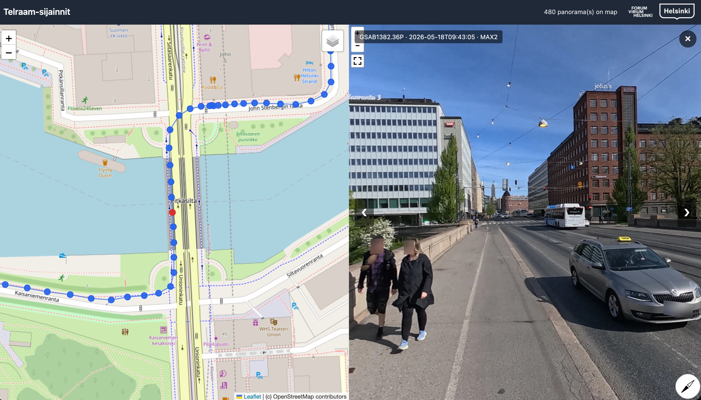

# Street Viewer 360

Local command-line tool that turns a folder of 360 panorama photos into a static, browsable web package: a Leaflet map with markers and a Pannellum panorama viewer. Optionally blurs faces and license plates.



See [PROJECT_DEVELOPMENT_PLAN.md](PROJECT_DEVELOPMENT_PLAN.md) for the full plan.

## Requirements

- macOS or Linux
- Python 3.13+
- [`uv`](https://github.com/astral-sh/uv)

## Setup

Base install (metadata + frontend only):

```bash
uv sync
uv run pre-commit install
```

Anonymization support (faces + license plates) needs heavy ML dependencies (torch, ultralytics). Install them as an optional extra:

```bash
uv sync --extra anonymization
```

## Usage

### 1. Generate a static package

```bash
uv run street-viewer-360 generate \
  --input ./data/test-photos \
  --output ./dist-output \
  --config ./config.example.yaml \
  --logo ./local-assets/logos/customer-logo.png \
  --logo ./local-assets/logos/partner-logo.png \
  --overwrite
```

Open `dist-output/index.html` via any static server:

```bash
python3 -m http.server -d dist-output 8765
# http://127.0.0.1:8765
```

Run `uv run street-viewer-360 generate --help` for all options.

### 2. Download default anonymization models (optional)

Anonymization is opt-in and requires YOLOv8 model files. You can either supply your own `.pt` weights, or fetch the bundled defaults:

```bash
uv run street-viewer-360 download-models --target ./models
```

This downloads:
- `yolov8n-face.pt` — face detection ([arnabdhar/YOLOv8-Face-Detection](https://huggingface.co/arnabdhar/YOLOv8-Face-Detection))
- `yolov11n-license-plate.pt` — license plate detection ([morsetechlab/yolov11-license-plate-detection](https://huggingface.co/morsetechlab/yolov11-license-plate-detection))

This step is one-time. After it, pass the model paths to `generate` via CLI:

```bash
uv run street-viewer-360 generate \
  --input ./data/test-photos \
  --output ./dist-output \
  --face-model ./models/yolov8n-face.pt \
  --plate-model ./models/yolov11n-license-plate.pt \
  --overwrite
```

…or set them in a config file:

```yaml
anonymization:
  enabled: true
  blur_sigma: 15
  confidence_threshold: 0.35
  face_model_path: ./models/yolov8n-face.pt
  plate_model_path: ./models/yolov11n-license-plate.pt
```

If anonymization is enabled but no model paths are configured, the generator logs a warning and writes panoramas without blur (status `no_models` in metadata). Pass `--no-anonymization` to skip entirely. **You are responsible for reviewing output before publication** — detectors are best-effort.

### Configuration

`config.example.yaml` documents all options. CLI flags override config values, which override the built-in defaults. Key CLI overrides:

```text
--input PATH              Source directory
--output PATH             Destination directory
--config PATH             Optional YAML config
--overwrite               Replace existing output directory
--device auto|cpu|cuda|mps
--include-without-gps     Include images lacking GPS in metadata.json
--face-model PATH         YOLOv8 face-detection model (.pt)
--plate-model PATH        YOLOv8 license-plate-detection model (.pt)
--no-anonymization        Skip anonymization entirely
--horizon MODE            auto | always | never (default auto)
--no-horizon              Shortcut for --horizon never
--pitch-offset FLOAT      Extra pitch (deg) applied during horizon correction
--roll-offset FLOAT       Extra roll (deg)
--heading-offset FLOAT    Extra heading (deg)
--output-format FORMAT    jpeg | webp (default webp)
--output-quality INT      Encoder quality 1-100 (default 90)
--webp-method INT         WebP encoder effort 0-6 (default 4)
--logo PATH               Header logo image; repeat to show multiple logos
--tiles PATH[:NAME]       Custom raster tile overlay; repeat for multiple layers
--dry-run                 Inspect without writing output
```

Header logos are copied into the generated package in the order they are passed. They are shown in the desktop/tablet header and hidden on narrow mobile screens so the title and panorama count remain readable.

Project-specific files that should stay out of git, such as customer logos or local sample inputs, can be stored under `local-assets/`. Documentation assets that should be committed live under `docs/assets/`.

### Horizon correction

Equirectangular panoramas from 360 cameras are rarely level. Street Viewer 360
reads the XMP `GPano:PosePitchDegrees`, `PoseRollDegrees`, and `PoseHeadingDegrees`
tags written by GoPro MAX 2 and compatible cameras and rotates the panorama
in-place so the horizon is level. By default this happens automatically when the
combined tilt exceeds `horizon.min_angle_degrees` (0.2°). Disable with
`--no-horizon`, or force on/off via `--horizon always|never`. After correction
the `Pose*Degrees` tags in the output are reset to 0.0 so downstream viewers do
not re-rotate.

### Custom tile overlays

Per-project raster tile layers (e.g. drone orthophotos, cadastral overlays) can
be added to the map without modifying the config. Pass `--tiles PATH[:NAME]` to
either `generate` or `refresh-frontend`, repeating the flag for multiple layers:

```bash
street-viewer-360 generate -i ./panos \
  --tiles ./tiles/orto_2024:"Orthophoto 2024" \
  --tiles ./tiles/kantakartta
```

The tile directory must follow the XYZ layout (`{z}/{x}/{y}.<ext>`, where
`<ext>` is `.png`, `.jpg`, or `.webp`). It is copied into `output/tiles/<slug>/`
and registered in `metadata.json` as `tile_overlays`. Each overlay is shown on
top of the active base layer, **enabled by default**, and toggleable from the
Leaflet layer control. If `:NAME` is omitted, the display name is derived from
the directory name (underscores become spaces, first letter capitalized — e.g.
`orto_2024` → `Orto 2024`).

Zoom range and tile file extension are auto-detected from the directory tree.

#### Producing tiles from a GeoTIFF (WebODM orthophoto)

Use `gdal2tiles.py` from GDAL (`brew install gdal`). WebP is recommended for
drone orthophotos because it preserves the alpha channel (transparent edges
where the orthophoto has no data) and produces ~30–50 % smaller files than JPEG
at the same visual quality:

```bash
gdal2tiles.py --xyz -z 14-22 -r bilinear --processes 4 -w none \
  --tiledriver=WEBP --webp-quality=75 \
  orthophoto.tif ./tiles/orto_2024
```

Notes:
- `--xyz` produces standard XYZ tiles (same convention as OpenStreetMap and
  Leaflet). Without it gdal2tiles writes TMS, which has an inverted Y axis.
- Adjust the zoom range to the area: `-z 18-22` is usually enough for a drone
  ortho. Add a lower bound (e.g. `14`) if you want the overlay to also appear
  when zoomed further out.
- JPEG (`--tiledriver=JPEG`) is only worthwhile if the source has no
  transparent areas — drone orthophotos almost always do, so WebP is the safer
  default.

## Output layout

```text
dist-output/
  index.html
  metadata.json
  generation_report.json
  images/
    pano_000001.jpg
    ...
  assets/
    app.js  styles.css
    leaflet/  pannellum/
  tiles/           # only when --tiles was used
    <slug>/{z}/{x}/{y}.<ext>
```

## Development

```bash
just lint    # ruff check
just fmt     # ruff format
just test    # pytest
just sample  # run against ./data/test-photos
```

## Status

Milestones 1–4 implemented (skeleton, metadata pipeline, static frontend, anonymization framework). See the project plan for upcoming items.
